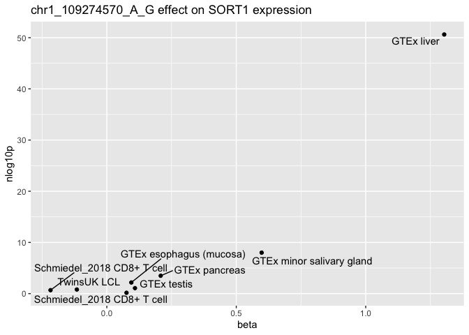

## Introduction

This notebook acts as a tutorial on how to use the eQTL Catalogue RESTful API v2 to make filtered requests. We will also perform colocalisation analysis in the end and visualise the results.

The eQTL API documentation can be seen here: <https://www.ebi.ac.uk/eqtl/api/docs>

## Importing libraries


```r
# If you do not already have all packages installed you can use this syntax to install them:
#install.packages(c("tidyverse", "httr", "jsonlite", "dplyr", "coloc", "ggrepel", "glue"))
```


```r
library("tidyverse")
```

```
## ── Attaching core tidyverse packages ──────────────────────── tidyverse 2.0.0 ──
## ✔ dplyr     1.1.0     ✔ readr     2.1.4
## ✔ forcats   1.0.0     ✔ stringr   1.5.0
## ✔ ggplot2   3.4.2     ✔ tibble    3.2.1
## ✔ lubridate 1.9.2     ✔ tidyr     1.3.0
## ✔ purrr     1.0.1     
## ── Conflicts ────────────────────────────────────────── tidyverse_conflicts() ──
## ✖ dplyr::filter() masks stats::filter()
## ✖ dplyr::lag()    masks stats::lag()
## ℹ Use the conflicted package (<http://conflicted.r-lib.org/>) to force all conflicts to become errors
```

```r
library("httr")
library("glue")
library("dplyr")
library("coloc")
```

```
## This is coloc version 5.2.1
```

```r
library("jsonlite")
```

```
## 
## Attaching package: 'jsonlite'
## 
## The following object is masked from 'package:purrr':
## 
##     flatten
```

```r
library("ggrepel")
```

## Making requests straight from the R notebook

We will use httr package to make requests straight from the R notebook. Here is the documentation of this package:

<https://cran.r-project.org/web/packages/httr/httr.pdf>

## What datasets are available in the API?

### Requesting all dataset_id-s from the API

In the API there is information given about many different datasets. If you want to see all of the datasets that exist in the API you can use the following syntax.

-   You can make a request by specifying an url in the GET(url) function.

-   We will use the "glue" package that is an equivalent to f-strings in python. It means that you can add values inside of strings.

-   status_code(request) can be used to check the status code of the request. If it is 200, the request was successful. Otherwise the request was unsuccessful.

-   Content can be extracted from the request. This can be converted to a dataframe.

-   Maximum number of rows pulled with the same request (size parameter) can be 1000.


```r
# Change parameters
max_pulled_rows = 1000 #All datasets will be pulled if this parameter is bigger than the actual number of datasets

URL = glue("https://www.ebi.ac.uk/eqtl/api/v2/datasets/?size={max_pulled_rows}")

# Make a request
r <- GET(URL, accept_json())
# Check status
status_code(r)
```

```
## [1] 200
```

```r
# Extract content
cont <- content(r, "text", encoding = "UTF-8")
# Convert content to dataframe
datasets <- fromJSON(cont)
knitr::kable(head(datasets, n = 20), format="markdown")
```


|study_id  |dataset_id |study_label |sample_group               |tissue_id  |tissue_label |condition_label        |sample_size |quant_method |
|:---------|:----------|:-----------|:--------------------------|:----------|:------------|:----------------------|:-----------|:------------|
|QTS000001 |QTD000001  |Alasoo_2018 |macrophage_naive           |CL_0000235 |macrophage   |naive                  |84          |ge           |
|QTS000001 |QTD000002  |Alasoo_2018 |macrophage_naive           |CL_0000235 |macrophage   |naive                  |84          |exon         |
|QTS000001 |QTD000003  |Alasoo_2018 |macrophage_naive           |CL_0000235 |macrophage   |naive                  |84          |tx           |
|QTS000001 |QTD000004  |Alasoo_2018 |macrophage_naive           |CL_0000235 |macrophage   |naive                  |84          |txrev        |
|QTS000001 |QTD000005  |Alasoo_2018 |macrophage_naive           |CL_0000235 |macrophage   |naive                  |84          |leafcutter   |
|QTS000001 |QTD000006  |Alasoo_2018 |macrophage_IFNg            |CL_0000235 |macrophage   |IFNg_18h               |84          |ge           |
|QTS000001 |QTD000007  |Alasoo_2018 |macrophage_IFNg            |CL_0000235 |macrophage   |IFNg_18h               |84          |exon         |
|QTS000001 |QTD000008  |Alasoo_2018 |macrophage_IFNg            |CL_0000235 |macrophage   |IFNg_18h               |84          |tx           |
|QTS000001 |QTD000009  |Alasoo_2018 |macrophage_IFNg            |CL_0000235 |macrophage   |IFNg_18h               |84          |txrev        |
|QTS000001 |QTD000010  |Alasoo_2018 |macrophage_IFNg            |CL_0000235 |macrophage   |IFNg_18h               |84          |leafcutter   |
|QTS000001 |QTD000011  |Alasoo_2018 |macrophage_Salmonella      |CL_0000235 |macrophage   |Salmonella_5h          |84          |ge           |
|QTS000001 |QTD000012  |Alasoo_2018 |macrophage_Salmonella      |CL_0000235 |macrophage   |Salmonella_5h          |84          |exon         |
|QTS000001 |QTD000013  |Alasoo_2018 |macrophage_Salmonella      |CL_0000235 |macrophage   |Salmonella_5h          |84          |tx           |
|QTS000001 |QTD000014  |Alasoo_2018 |macrophage_Salmonella      |CL_0000235 |macrophage   |Salmonella_5h          |84          |txrev        |
|QTS000001 |QTD000015  |Alasoo_2018 |macrophage_Salmonella      |CL_0000235 |macrophage   |Salmonella_5h          |84          |leafcutter   |
|QTS000001 |QTD000016  |Alasoo_2018 |macrophage_IFNg+Salmonella |CL_0000235 |macrophage   |IFNg_18h+Salmonella_5h |84          |ge           |
|QTS000001 |QTD000017  |Alasoo_2018 |macrophage_IFNg+Salmonella |CL_0000235 |macrophage   |IFNg_18h+Salmonella_5h |84          |exon         |
|QTS000001 |QTD000018  |Alasoo_2018 |macrophage_IFNg+Salmonella |CL_0000235 |macrophage   |IFNg_18h+Salmonella_5h |84          |tx           |
|QTS000001 |QTD000019  |Alasoo_2018 |macrophage_IFNg+Salmonella |CL_0000235 |macrophage   |IFNg_18h+Salmonella_5h |84          |txrev        |
|QTS000001 |QTD000020  |Alasoo_2018 |macrophage_IFNg+Salmonella |CL_0000235 |macrophage   |IFNg_18h+Salmonella_5h |84          |leafcutter   |

### Requesting only relevant dataset_ids by adding filters to our requests.

We can see that there were 564 possible datasets to choose from. It is also possible to add different filters to this request, to get relevant datasets. The filters can be added straight to the request url. The first filter has to start with a question mark (?param=value) and the next ones can be added with "and" (&param=value). Here we filter out all the datasets that have quant_method=ge and tissue_label=liver.


```r
# Change parameters
set_quant_method = "ge"
set_tissue_label = "liver"

URL = glue("https://www.ebi.ac.uk/eqtl/api/v2/datasets/?quant_method={set_quant_method}&tissue_label={set_tissue_label}")

r <- GET(URL, accept_json())
cont <- content(r, "text", encoding = "UTF-8")
datasets_filtered <- fromJSON(cont)
datasets_filtered
```

```
##    study_id dataset_id study_label sample_group      tissue_id tissue_label
## 1 QTS000015  QTD000266        GTEx        liver UBERON_0001114        liver
##   condition_label sample_size quant_method
## 1           naive         208           ge
```

### Function to filter relevant datasets

Possible parameters:

-   study_id (string) - Study ID, e.g. QTS000001

-   quant_method (string) - Quantification method

    -   Available values : ge, exon, microarray, tx, txrev, leafcutter, aptamer

-   sample_group (string) - Controlled vocabulary for the QTL group

    -   Example : macrophage_naive

-   tissue_id (string) - Ontology term for the tissue/cell type

    -   Example : CL_0000235

-   study_label (string) - *Example* : Alasoo_2018

-   tissue_label (string) - Controlled vocabulary for the tissue/cell type

    -   *Example* : macrophage

-   condition_label (string) - More verbose condition description

    -   *Example* : naive


```r
request_datasets_from_api <- function(study_id = "",
                                      quant_method = "",
                                      sample_group = "",
                                      tissue_id = "",
                                      study_label = "",
                                      tissue_label = "",
                                      condition_label = "") {
  size = 1000 #Page size
  start = 0 #Page start
  
  parameter_values = c(study_id,quant_method,sample_group,tissue_id,study_label, 
                       tissue_label,condition_label)
  parameter_names = c('study_id','quant_method','sample_group','tissue_id',
                      'study_label','tissue_label','condition_label')
  
  while (T) {
    URL = glue("https://www.ebi.ac.uk/eqtl/api/v2/datasets/?size={size}&start={start}")
    
    #Adding defined parameters to the request
    for (i in 1:length(parameter_values)) {
      par = parameter_values[i]
      par_name = parameter_names[i]
      if (par != "")
        URL = glue("{URL}&{par_name}={par}")
    }
    
    r <- GET(URL, accept_json())
    cont <- content(r, "text", encoding = "UTF-8")
    
    # If the request was unsuccessful
    if (status_code(r) != 200) {
      #If we get no results at all, print error
      if (start == 0) {
        print(glue("Error {status_code(r)}"))
        print(cont)
        return ()
      }
      #else just break
      break
    }
    
    cont_df <- fromJSON(cont)
    
    if (start == 0) {
      responses <- cont_df
    }
    else{
      responses <- rbind(responses, cont_df)
    }
    start <- start + size
  }
  return(responses)
}
```

Examples:


```r
request_datasets_from_api(quant_method = "ge", tissue_label = "liver")
```

```
##    study_id dataset_id study_label sample_group      tissue_id tissue_label
## 1 QTS000015  QTD000266        GTEx        liver UBERON_0001114        liver
##   condition_label sample_size quant_method
## 1           naive         208           ge
```


```r
request_datasets_from_api(quant_method = "ge", study_label = "Alasoo_2018")
```

```
##    study_id dataset_id study_label               sample_group  tissue_id
## 1 QTS000001  QTD000001 Alasoo_2018           macrophage_naive CL_0000235
## 2 QTS000001  QTD000006 Alasoo_2018            macrophage_IFNg CL_0000235
## 3 QTS000001  QTD000011 Alasoo_2018      macrophage_Salmonella CL_0000235
## 4 QTS000001  QTD000016 Alasoo_2018 macrophage_IFNg+Salmonella CL_0000235
##   tissue_label        condition_label sample_size quant_method
## 1   macrophage                  naive          84           ge
## 2   macrophage               IFNg_18h          84           ge
## 3   macrophage          Salmonella_5h          84           ge
## 4   macrophage IFNg_18h+Salmonella_5h          84           ge
```

## What kind of metadata do we have about each dataset?

It is possible to get the metadata for each dataset that is available in the API. In this example we use the only dataset that we got when quant_method=ge and tissue_label=liver.


```r
# Change parameters
set_dataset_id = 'QTD000266'
  
URL = glue("https://www.ebi.ac.uk/eqtl/api/v2/datasets/{set_dataset_id}")

r <- GET(URL, accept_json())
cont <- content(r, "text", encoding = "UTF-8")
dataset_metadata <- fromJSON(cont)
dataset_metadata
```

```
## $study_id
## [1] "QTS000015"
## 
## $quant_method
## [1] "ge"
## 
## $sample_group
## [1] "liver"
## 
## $tissue_id
## [1] "UBERON_0001114"
## 
## $study_label
## [1] "GTEx"
## 
## $tissue_label
## [1] "liver"
## 
## $condition_label
## [1] "naive"
## 
## $dataset_id
## [1] "QTD000266"
## 
## $sample_size
## [1] 208
```

## What associations exist in a given region?

There are many parameters that can be specified while making a request for associations. They are all described in the API documentation. We will define a function that requests a region around given chromosome and position and return the results as a data frame.


```r
request_associations_around_position <- function(dataset_id, position, chromosome_id, gene_id, offset = 500000){
  size = 1000
  start = 0
  range_start = position - offset
  range_end = position + offset
  
  
  while (TRUE){
    URL = glue("https://www.ebi.ac.uk/eqtl/api/v2/datasets/{dataset_id}/associations?size={size}&start={start}&pos={chromosome_id}:{range_start}-{range_end}&gene_id={gene_id}")
    
    r <- GET(URL, accept_json())
    cont <- content(r, "text", encoding = "UTF-8")
    
    if (status_code(r) != 200) {
      # Loop will break if the request was unsuccessful
      if(start==0) {
        print(glue("Error {status_code(r)}"))
        print(cont)
        return()}
      break
    }
    
   
    cont_df <- fromJSON(cont)
    
    if (start == 0){
      responses <- cont_df
    }
    else{
      responses <- rbind(responses, cont_df)
    }
    start <- start + size
  }
  return(responses)
}
```


```r
# Change parameters
dataset_id = "QTD000266"
position = 109274570
chromosome_id = 1
gene_id = "ENSG00000134243" #SORT1 gene

associations <- request_associations_around_position(dataset_id, position, chromosome_id, gene_id)
knitr::kable(head(associations), format="markdown")
```


|   nlog10p|   pvalue|molecular_trait_id |gene_id         |  position|chromosome |ref |alt |type |variant            |rsid        |  ac|  an|       beta|       maf| median_tpm|r2 |       se|
|---------:|--------:|:------------------|:---------------|---------:|:----------|:---|:---|:----|:------------------|:-----------|---:|---:|----------:|---------:|----------:|:--|--------:|
| 0.1978190| 0.634134|ENSG00000134243    |ENSG00000134243 | 108418806|1          |G   |A   |SNP  |chr1_108418806_G_A |rs201831944 |  25| 416| -0.0954853| 0.0600962|      5.195|NA | 0.200316|
| 0.1427821| 0.719810|ENSG00000134243    |ENSG00000134243 | 108447888|1          |T   |C   |SNP  |chr1_108447888_T_C |rs144995992 |   7| 416| -0.1313800| 0.0168269|      5.195|NA | 0.365719|
| 0.8615078| 0.137560|ENSG00000134243    |ENSG00000134243 | 108447965|1          |T   |G   |SNP  |chr1_108447965_T_G |rs61797098  | 358| 416|  0.2027430| 0.1394230|      5.195|NA | 0.135966|
| 0.9636227| 0.108737|ENSG00000134243    |ENSG00000134243 | 108448177|1          |C   |A   |SNP  |chr1_108448177_C_A |rs141758896 |   6| 416| -0.6217940| 0.0144231|      5.195|NA | 0.385883|
| 0.1986436| 0.632931|ENSG00000134243    |ENSG00000134243 | 108448359|1          |A   |C   |SNP  |chr1_108448359_A_C |rs199532249 |  47| 416|  0.0722378| 0.1129810|      5.195|NA | 0.151010|
| 0.0898491| 0.813113|ENSG00000134243    |ENSG00000134243 | 108448439|1          |G   |C   |SNP  |chr1_108448439_G_C |rs572332383 |  16| 416|  0.0543856| 0.0384615|      5.195|NA | 0.229731|

## Function for requesting associations from a dataset with all possible parameters

-   dataset_id (string, required) - Dataset ID. A dataset represents a study & QTL context for a single quantification method

-   pos (string) - Genomic region to filter, e.g 19:80000-90000

-   variant (string) - The variant ID (CHR_BP_REF_ALT), e.g. chr19_80901_G\_T

-   rsid (string) - The rsID, if given, for the variant, e.g. rs879890648

-   molecular_traint_id (string) - ID of the molecular trait used for QTL mapping, e.g. ENSG00000282458

-   gene_id (string) - Ensembl gene ID of the molecular trait, e.g. ENSG00000282458

-   nlog10p (number) - P-value cutoff, in -Log10 format, e.g. 10.0


```r
request_associations_from_api <- function(
    dataset_id, 
    pos="",
    variant="", 
    rsid="",
    molecular_trait_id="",
    gene_id="",
    nlog10p=""){
  
  size = 1000
  start = 0
  
  parameter_values = c(dataset_id,pos,variant,rsid,molecular_trait_id, 
                       gene_id,nlog10p)
  parameter_names = c('dataset_id','pos','variant','rsid','molecular_trait_id', 
                       'gene_id','nlog10p')
  
  while (T) {
    URL = glue("https://www.ebi.ac.uk/eqtl/api/v2/datasets/{dataset_id}/associations?size={size}&start={start}")
    
    #Adding defined parameters to the request
    for (i in 1:length(parameter_values)) {
      par = parameter_values[i]
      par_name = parameter_names[i]
      if (par != "")
        URL = glue("{URL}&{par_name}={par}")
    }
    
    r <- GET(URL, accept_json())
    cont <- content(r, "text", encoding = "UTF-8")
    
    # If the request was unsuccessful
    if (status_code(r) != 200) {
      #If we get no results at all, print error
      if (start == 0) {
        print(glue("Error {status_code(r)}"))
        print(cont)
        return ()
      }
      #else just break
      break
    }
    
    cont_df <- fromJSON(cont)
    
    if (start == 0) {
      responses <- cont_df
    }
    else{
      responses <- rbind(responses, cont_df)
    }
    start <- start + size
  }
  return(responses)
}
```


```r
#Examples
assoc = request_associations_from_api(dataset_id="QTD000266", gene_id = "ENSG00000134243",  nlog10p=10)
knitr::kable(assoc, format="markdown")
```


|  nlog10p| pvalue|molecular_trait_id |gene_id         |  position|chromosome |ref |alt |type  |variant             |rsid        |  ac|  an|      beta|       maf| median_tpm|r2 |        se|
|--------:|------:|:------------------|:---------------|---------:|:----------|:---|:---|:-----|:-------------------|:-----------|---:|---:|---------:|---------:|----------:|:--|---------:|
| 13.43878|      0|ENSG00000134243    |ENSG00000134243 | 109233663|1          |T   |C   |SNP   |chr1_109233663_T_C  |rs35271870  |  39| 416|  1.145640| 0.0937500|      5.195|NA | 0.1399820|
| 16.70976|      0|ENSG00000134243    |ENSG00000134243 | 109257699|1          |C   |T   |SNP   |chr1_109257699_C_T  |rs12746961  |  41| 416|  1.242360| 0.0985577|      5.195|NA | 0.1325770|
| 16.70976|      0|ENSG00000134243    |ENSG00000134243 | 109257727|1          |G   |A   |SNP   |chr1_109257727_G_A  |rs12731760  |  41| 416|  1.242360| 0.0985577|      5.195|NA | 0.1325770|
| 16.19208|      0|ENSG00000134243    |ENSG00000134243 | 109262261|1          |C   |G   |SNP   |chr1_109262261_C_G  |rs66795935  |  46| 416|  1.161780| 0.1105770|      5.195|NA | 0.1264570|
| 21.24683|      0|ENSG00000134243    |ENSG00000134243 | 109264661|1          |A   |T   |SNP   |chr1_109264661_A_T  |rs6657811   |  69| 416|  1.044000| 0.1658650|      5.195|NA | 0.0954619|
| 21.40083|      0|ENSG00000134243    |ENSG00000134243 | 109272258|1          |C   |T   |SNP   |chr1_109272258_C_T  |rs4970834   |  88| 416|  1.038230| 0.2115380|      5.195|NA | 0.0944849|
| 27.35156|      0|ENSG00000134243    |ENSG00000134243 | 109272630|1          |A   |G   |SNP   |chr1_109272630_A_G  |rs611917    | 138| 416|  1.015850| 0.3317310|      5.195|NA | 0.0783136|
| 34.83696|      0|ENSG00000134243    |ENSG00000134243 | 109274241|1          |T   |TC  |INDEL |chr1_109274241_T_TC |rs552693039 |  74| 416|  1.291860| 0.1778850|      5.195|NA | 0.0836454|
| 34.83696|      0|ENSG00000134243    |ENSG00000134243 | 109274241|1          |T   |TC  |INDEL |chr1_109274241_T_TC |rs56246620  |  74| 416|  1.291860| 0.1778850|      5.195|NA | 0.0836454|
| 34.83696|      0|ENSG00000134243    |ENSG00000134243 | 109274241|1          |T   |TC  |INDEL |chr1_109274241_T_TC |rs397740382 |  74| 416|  1.291860| 0.1778850|      5.195|NA | 0.0836454|
| 50.62259|      0|ENSG00000134243    |ENSG00000134243 | 109274570|1          |A   |G   |SNP   |chr1_109274570_A_G  |rs7528419   | 100| 416|  1.303190| 0.2403850|      5.195|NA | 0.0624692|
| 19.03473|      0|ENSG00000134243    |ENSG00000134243 | 109274623|1          |C   |T   |SNP   |chr1_109274623_C_T  |rs11102967  | 258| 416| -0.886892| 0.3798080|      5.195|NA | 0.0871068|
| 53.48765|      0|ENSG00000134243    |ENSG00000134243 | 109274968|1          |G   |T   |SNP   |chr1_109274968_G_T  |rs12740374  |  99| 416|  1.324230| 0.2379810|      5.195|NA | 0.0604713|
| 46.31503|      0|ENSG00000134243    |ENSG00000134243 | 109275216|1          |T   |C   |SNP   |chr1_109275216_T_C  |rs660240    | 314| 416| -1.269330| 0.2451920|      5.195|NA | 0.0656373|
| 47.40861|      0|ENSG00000134243    |ENSG00000134243 | 109275536|1          |C   |CT  |INDEL |chr1_109275536_C_CT |rs3832016   | 308| 408| -1.294040| 0.2450980|      5.195|NA | 0.0656163|
| 46.58372|      0|ENSG00000134243    |ENSG00000134243 | 109275684|1          |G   |T   |SNP   |chr1_109275684_G_T  |rs629301    | 313| 416| -1.271600| 0.2475960|      5.195|NA | 0.0654375|
| 46.58372|      0|ENSG00000134243    |ENSG00000134243 | 109275908|1          |C   |T   |SNP   |chr1_109275908_C_T  |rs646776    | 313| 416| -1.271600| 0.2475960|      5.195|NA | 0.0654375|
| 18.29377|      0|ENSG00000134243    |ENSG00000134243 | 109276674|1          |C   |A   |SNP   |chr1_109276674_C_A  |rs3902354   | 256| 416| -0.882041| 0.3846150|      5.195|NA | 0.0888658|
| 18.78847|      0|ENSG00000134243    |ENSG00000134243 | 109276993|1          |C   |T   |SNP   |chr1_109276993_C_T  |rs67269326  |  43| 416|  1.270020| 0.1033650|      5.195|NA | 0.1257850|
| 18.78847|      0|ENSG00000134243    |ENSG00000134243 | 109277359|1          |C   |T   |SNP   |chr1_109277359_C_T  |rs55882046  |  43| 416|  1.270020| 0.1033650|      5.195|NA | 0.1257850|
| 17.98262|      0|ENSG00000134243    |ENSG00000134243 | 109278262|1          |A   |G   |SNP   |chr1_109278262_A_G  |rs11577931  |  40| 416|  1.301740| 0.0961538|      5.195|NA | 0.1325950|
| 32.67226|      0|ENSG00000134243    |ENSG00000134243 | 109278685|1          |G   |T   |SNP   |chr1_109278685_G_T  |rs583104    | 297| 416| -1.145500| 0.2860580|      5.195|NA | 0.0777793|
| 34.29337|      0|ENSG00000134243    |ENSG00000134243 | 109278889|1          |T   |G   |SNP   |chr1_109278889_T_G  |rs602633    | 299| 416| -1.168630| 0.2812500|      5.195|NA | 0.0765608|
| 17.96292|      0|ENSG00000134243    |ENSG00000134243 | 109279386|1          |G   |T   |SNP   |chr1_109279386_G_T  |rs4970837   | 257| 416| -0.869331| 0.3822120|      5.195|NA | 0.0886120|
| 32.67226|      0|ENSG00000134243    |ENSG00000134243 | 109279521|1          |G   |A   |SNP   |chr1_109279521_G_A  |rs1277930   | 297| 416| -1.145500| 0.2860580|      5.195|NA | 0.0777793|
| 32.67226|      0|ENSG00000134243    |ENSG00000134243 | 109279544|1          |G   |A   |SNP   |chr1_109279544_G_A  |rs599839    | 297| 416| -1.145500| 0.2860580|      5.195|NA | 0.0777793|

## Colocalisation: SORT1 eQTL and VitD GWAS

Here we will test the colocalisation between the pulled SORT1 eQTL dataset and Vitamin D GWAS statistics.


```r
dataset_id = "QTD000266"
position = 109274570
chromosome_id = 1
gene_id = "ENSG00000134243" #SORT1 gene
gwas_region="chr1_107774781-110774507"

sort1 = request_associations_around_position(dataset_id, position, chromosome_id, gene_id) %>%
  dplyr::select(-rsid) %>%
  dplyr::distinct()

# Import VitD 
VitD = readr::read_tsv("https://zenodo.org/record/7901534/files/VitD.coloc3_combined.tsv.gz") 
```

```
## Rows: 877973 Columns: 15
## ── Column specification ────────────────────────────────────────────────────────
## Delimiter: "\t"
## chr (5): molecular_trait_id, region, variant, ref, alt
## dbl (6): chromosome, position, maf, beta, se, an
## lgl (4): ac, n, log10p, info
## 
## ℹ Use `spec()` to retrieve the full column specification for this data.
## ℹ Specify the column types or set `show_col_types = FALSE` to quiet this message.
```

```r
VitD = VitD %>%
  dplyr::filter(region == gwas_region) %>%
  dplyr::filter(maf > 0 & maf < 1)

# Run coloc.abf
sort1_list = list(beta = sort1$beta, 
                varbeta = sort1$se^2, 
                N = sort1$an/2, 
                MAF = sort1$maf, 
                snp = sort1$variant, 
                type = "quant")
coloc::check_dataset(sort1_list)
```

```
## NULL
```

```r
vitd_list = list(beta = VitD$beta, 
                varbeta = VitD$se^2, 
                N = VitD$an/2, 
                MAF = VitD$maf, 
                snp = VitD$variant, 
                type = "quant")
coloc::check_dataset(vitd_list)
```

```
## NULL
```

```r
sort1_coloc_abf = coloc.abf(sort1_list, vitd_list)
```

```
## Warning in sdY.est(d$varbeta, d$MAF, d$N): estimating sdY from maf and varbeta,
## please directly supply sdY if known

## Warning in sdY.est(d$varbeta, d$MAF, d$N): estimating sdY from maf and varbeta,
## please directly supply sdY if known
```

```
## Warning in adjust_prior(p2, nrow(df2), "2"): p2 * nsnps >= 1, setting
## p2=1/(nsnps + 1)
```

```
## PP.H0.abf PP.H1.abf PP.H2.abf PP.H3.abf PP.H4.abf 
##  5.32e-91  3.57e-07  5.49e-87  2.94e-03  9.97e-01 
## [1] "PP abf for shared variant: 99.7%"
```


```r
sort1_coloc_abf
```

```
## Coloc analysis of trait 1, trait 2
```

```
## 
## SNP Priors
```

```
##           p1           p2          p12 
## 1.000000e-04 7.575184e-05 1.000000e-05
```

```
## 
## Hypothesis Priors
```

```
##         H0     H1        H2        H3      H4
##  0.4797859 0.2538 0.1922582 0.0487759 0.02538
```

```
## 
## Posterior
```

```
##        nsnps           H0           H1           H2           H3           H4 
## 2.538000e+03 5.317878e-91 3.574438e-07 5.494250e-87 2.937695e-03 9.970619e-01
```

## chr1_109274570_A\_G effect on SORT1 expression

Here we will test the chr1_109274570_A\_G effect on SORT1 expression across all gene expression QTL datasets and visualise the results. Note that this step can be quite slow.


```r
# Filtering out variant statistics from all given datasets and merging the information with dataset metadata

get_assoc_over_datasets <- function(datasets, variant, gene_id) {
  size = 1000
  first = T
  for (i in rownames(datasets)) {
    row = datasets[i, ]
    dataset_id = row$dataset_id
    
    URL = glue(
      "https://www.ebi.ac.uk/eqtl/api/v2/datasets/{dataset_id}/associations?size={size}&variant={variant}&gene_id={gene_id}"
    )
    
    r <- GET(URL, accept_json())
    
    if (status_code(r) != 200) {
      next
    }
    
    cont <- content(r, "text", encoding = "UTF-8")
    cont_df <- fromJSON(cont)
    cont_with_metadata <- cbind(cont_df, row)
    
    if (first) {
      final_df <- cont_with_metadata
      first = F
    }
    else{
      final_df <- rbind(final_df, cont_with_metadata)
    }
  }
  return (final_df)
}
```


```r
# Change parameters
variant = "chr1_109274570_A_G"
gene_id = "ENSG00000134243"

#Filtering out all gene expression studies
datasets_ge = request_datasets_from_api(quant_method = "ge")

associations <- get_assoc_over_datasets(datasets=datasets_ge, variant=variant, gene_id=gene_id)
associations
```

```
##      nlog10p      pvalue molecular_trait_id         gene_id  position
## 1  2.1720592 6.72885e-03    ENSG00000134243 ENSG00000134243 109274570
## 2 50.6225881 2.38458e-51    ENSG00000134243 ENSG00000134243 109274570
## 3  8.0040302 9.90763e-09    ENSG00000134243 ENSG00000134243 109274570
## 4  3.4914474 3.22517e-04    ENSG00000134243 ENSG00000134243 109274570
## 5  1.0725265 8.46201e-02    ENSG00000134243 ENSG00000134243 109274570
## 6  0.1635195 6.86247e-01    ENSG00000134243 ENSG00000134243 109274570
## 7  0.6741233 2.11776e-01    ENSG00000134243 ENSG00000134243 109274570
## 8  0.8017114 1.57866e-01    ENSG00000134243 ENSG00000134243 109274570
##   chromosome ref alt type            variant      rsid  ac  an       beta
## 1          1   A   G  SNP chr1_109274570_A_G rs7528419 213 986  0.0946153
## 2          1   A   G  SNP chr1_109274570_A_G rs7528419 100 416  1.3031900
## 3          1   A   G  SNP chr1_109274570_A_G rs7528419  70 288  0.5980440
## 4          1   A   G  SNP chr1_109274570_A_G rs7528419 141 610  0.2080420
## 5          1   A   G  SNP chr1_109274570_A_G rs7528419 140 644  0.1087780
## 6          1   A   G  SNP chr1_109274570_A_G rs7528419  31 178  0.0760354
## 7          1   A   G  SNP chr1_109274570_A_G rs7528419  31 176 -0.2174920
## 8          1   A   G  SNP chr1_109274570_A_G rs7528419 167 836 -0.1157690
##        maf median_tpm      r2        se  study_id dataset_id    study_label
## 1 0.216024     62.016      NA 0.0347614 QTS000015  QTD000241           GTEx
## 2 0.240385      5.195      NA 0.0624692 QTS000015  QTD000266           GTEx
## 3 0.243056     54.939      NA 0.0975501 QTS000015  QTD000276           GTEx
## 4 0.231148     12.950      NA 0.0571514 QTS000015  QTD000296           GTEx
## 5 0.217391    105.010      NA 0.0628744 QTS000015  QTD000336           GTEx
## 6 0.174157      2.934 0.99997 0.1874890 QTS000026  QTD000489 Schmiedel_2018
## 7 0.176136      1.712 0.99997 0.1726490 QTS000026  QTD000494 Schmiedel_2018
## 8 0.199761      1.798 0.96776 0.0818204 QTS000029  QTD000539        TwinsUK
##               sample_group      tissue_id         tissue_label  condition_label
## 1         esophagus_mucosa UBERON_0006920   esophagus (mucosa)            naive
## 2                    liver UBERON_0001114                liver            naive
## 3     minor_salivary_gland UBERON_0006330 minor salivary gland            naive
## 4                 pancreas UBERON_0001150             pancreas            naive
## 5                   testis UBERON_0000473               testis            naive
## 6         CD8_T-cell_naive     CL_0000625          CD8+ T cell            naive
## 7 CD8_T-cell_anti-CD3-CD28     CL_0000625          CD8+ T cell anti-CD3-CD28_4h
## 8                      LCL    EFO_0005292                  LCL            naive
##   sample_size quant_method
## 1         493           ge
## 2         208           ge
## 3         144           ge
## 4         305           ge
## 5         322           ge
## 6          89           ge
## 7          88           ge
## 8         418           ge
```


```r
# Visualising the result
associations %>%
  unite(study, study_label, tissue_label, sep = " ", remove = FALSE) %>%
ggplot(aes(x = beta, y = nlog10p, label = study)) +
  geom_point() +
  geom_text_repel() +
  ggtitle("chr1_109274570_A_G effect on SORT1 expression")
```

<!-- -->
