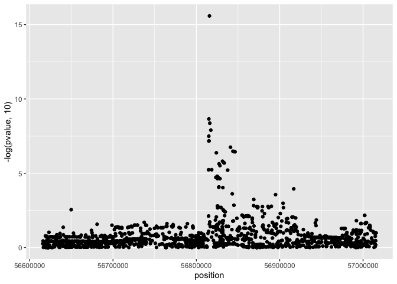
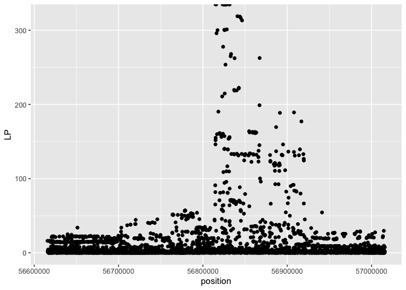

# Accessing eQTL Catalogue summary statistics with tabix

## Setting up the environment

First, we need to load the required R packages

```r
library("dplyr")
library("ggplot2")
library("readr")
library("coloc")
library("GenomicRanges")
library("seqminer")
```

We also need the paths to individual tabix-indexed summary-statistics files. These can be obtained from eQTL Catalogue resources GitHub repository:


```r
tabix_paths = read.delim("https://raw.githubusercontent.com/eQTL-Catalogue/eQTL-Catalogue-resources/master/tabix/tabix_ftp_paths.tsv", sep = "\t", header = TRUE, stringsAsFactors = FALSE) %>% dplyr::as_tibble()
imported_tabix_paths = read.delim("https://raw.githubusercontent.com/eQTL-Catalogue/eQTL-Catalogue-resources/master/tabix/tabix_ftp_paths_imported.tsv", sep = "\t", header = TRUE, stringsAsFactors = FALSE) %>% dplyr::as_tibble()
```

In eQTL Catalogue, **variants with multiple rsids are split over multiple rows** in the summary statistics files. Thus, we first want to retain only one unique record per variant. To simplify colocalisation analysis, we also want to exclude multi-allelic variants. The following function imports summary statistics from a tabix-indexed TSV file and performs necessary filtering.


```r
import_eQTLCatalogue <- function(ftp_path, region, selected_gene_id, column_names, verbose = TRUE){
  
  if(verbose){
      print(ftp_path)
  }
  
  #Fetch summary statistics with seqminer
  fetch_table = seqminer::tabix.read.table(tabixFile = ftp_path, tabixRange = region, stringsAsFactors = FALSE) %>%
    dplyr::as_tibble()
  colnames(fetch_table) = column_names
  
  #Remove rsid duplicates and multi-allelic variant
  summary_stats = dplyr::filter(fetch_table, gene_id == selected_gene_id) %>%
    dplyr::select(-rsid) %>% 
    dplyr::distinct() %>% #rsid duplicates
    dplyr::mutate(id = paste(chromosome, position, sep = ":")) %>% 
    dplyr::group_by(id) %>% 
    dplyr::mutate(row_count = n()) %>% dplyr::ungroup() %>% 
    dplyr::filter(row_count == 1) #Multialllics
}
```


## Mean platelet volume association at the ARHGEF3 locus
Here, the lead variant of interest is chr3_56815721_T_C (rs1354034). For colocalistion analysis, let's define a region +/- 200kb around this variant: 


```r
region = "3:56649749-57049749"
```

Since this is a known platelet-specific eQTL, let's first fetch this region from the platelet summary statistics of the CEDAR study:

```r
platelet_df = dplyr::filter(tabix_paths, study == "CEDAR", tissue_label == "platelet")

#Extract column names from first file
column_names = colnames(readr::read_tsv(platelet_df$ftp_path, n_max = 1))

#Import summary statistics
summary_stats = import_eQTLCatalogue(platelet_df$ftp_path, region, selected_gene_id = "ENSG00000163947", column_names)
```

```
## [1] "ftp://ftp.ebi.ac.uk/pub/databases/spot/eQTL/csv/CEDAR/microarray/CEDAR_microarray_platelet.all.tsv.gz"
```

```r
summary_stats
```

```
## # A tibble: 1,573 x 20
##    molecular_trait… chromosome position ref   alt   variant ma_samples
##    <chr>                 <int>    <int> <chr> <chr> <chr>        <int>
##  1 ILMN_1781010              3 56649804 G     T     chr3_5…         14
##  2 ILMN_1781010              3 56649864 A     G     chr3_5…         23
##  3 ILMN_1781010              3 56650196 G     A     chr3_5…         13
##  4 ILMN_1781010              3 56650217 A     T     chr3_5…          7
##  5 ILMN_1781010              3 56650492 T     G     chr3_5…        136
##  6 ILMN_1781010              3 56650617 G     A     chr3_5…         25
##  7 ILMN_1781010              3 56650620 C     T     chr3_5…         30
##  8 ILMN_1781010              3 56650722 C     G     chr3_5…         13
##  9 ILMN_1781010              3 56650737 C     T     chr3_5…         30
## 10 ILMN_1781010              3 56650791 C     G     chr3_5…         24
## # … with 1,563 more rows, and 13 more variables: maf <dbl>, pvalue <dbl>,
## #   beta <dbl>, se <dbl>, type <chr>, ac <int>, an <int>, r2 <dbl>,
## #   molecular_trait_object_id <chr>, gene_id <chr>, median_tpm <lgl>,
## #   id <chr>, row_count <int>
```

We can easily visualise the association with ggplot2.

```r
ggplot(summary_stats, aes(x = position, y = -log(pvalue, 10))) + 
geom_point()
```

<!-- -->

# Fetch GWAS summary statistics from the same region from IEU OpenGWAS database

Most GWAS summary statistics still use GRCh37 coordinates, so we first look up the coordinate of the rs1354034 variant in GRCh37, which is 3:56849749. We will use GWAS summary statistics for [mean platelet volume](https://gwas.mrcieu.ac.uk/datasets/ebi-a-GCST004599/) from the [IEU OpenGWAS database](https://gwas.mrcieu.ac.uk/), because they have released all summary statistics in [uniformly formatted VCF files](https://www.biorxiv.org/content/10.1101/2020.05.29.115824v1). These files can be queried using the [gwasvcf](https://github.com/MRCIEU/gwasvcf) R package:


```r
# First, download the VCF file with 'wget https://gwas.mrcieu.ac.uk/files/ebi-a-GCST004599/ebi-a-GCST004599.vcf.gz'
#and its tabix index with 'wget https://gwas.mrcieu.ac.uk/files/ebi-a-GCST004599/ebi-a-GCST004599.vcf.gz.tbi'
gwas_stats = gwasvcf::query_gwas("tabix_data/ebi-a-GCST004599.vcf.gz", chrompos = region)
gwas_stats = gwasvcf::vcf_to_granges(gwas_stats) %>% 
  keepSeqlevels("3") %>% 
  renameSeqlevels("chr3")
```

Next, we can use the liftOver command from the rtracklayer package to convert the chromosome coordinates from GRCh37 to GRCh38.

Note that the `rtracklayer::import.chain()` function does not seem to work with Ensembl chain files, so we have to use the UCSC hg19ToHg38.over.chain file and convert chromosome names from 3 to chr3 and back.

```r
#Download the chain file first using 'wget http://hgdownload.soe.ucsc.edu/goldenPath/hg19/liftOver/hg19ToHg38.over.chain.gz'

#Import chain file
chain = rtracklayer::import.chain("tabix_data/hg19ToHg38.over.chain")

#Lift over summary statistics
gwas_stats_hg38 = rtracklayer::liftOver(gwas_stats, chain) %>% 
  unlist() %>% 
  renameSeqlevels("3") %>%
  dplyr::as_tibble() %>%
  dplyr::transmute(chromosome = seqnames, position = start, AF, ES, SE, LP, SS) %>%
  dplyr::mutate(id = paste(chromosome, position, sep = ":")) %>%
  dplyr::mutate(MAF = pmin(AF, 1-AF)) %>% #Calculate MAF
  dplyr::group_by(id) %>% #Keep bi-alleilic variants
  dplyr::mutate(row_count = n()) %>% 
  dplyr::ungroup() %>% 
  dplyr::filter(row_count == 1) 
```

And visualise the association


```r
ggplot(gwas_stats_hg38, aes(x = position, y = LP)) + 
geom_point()
```

<!-- -->

## Performing colocalisation

Define a helper function for colocalisation

```r
run_coloc <- function(eqtl_sumstats, gwas_sumstats){
    eQTL_dataset = list(beta = eqtl_sumstats$beta,
                        varbeta = eqtl_sumstats$se^2,
                        N = (eqtl_sumstats$an)[1]/2, # Samples size is allele number (AN) dvided by 2
                        MAF = eqtl_sumstats$maf, 
                        type = "quant", 
                        snp = eqtl_sumstats$id)
  gwas_dataset = list(beta = gwas_sumstats$ES,
                      varbeta = gwas_sumstats$SE^2, 
                      type = "quant", 
                      snp = gwas_sumstats$id,
                      MAF = gwas_sumstats$MAF, 
                      N = gwas_sumstats$SS)
  coloc_res = coloc::coloc.abf(dataset1 = eQTL_dataset, dataset2 = gwas_dataset,p1 = 1e-4, p2 = 1e-4, p12 = 1e-5)
  res_formatted = dplyr::as_tibble(t(as.data.frame(coloc_res$summary)))
  return(res_formatted)
}
```

Perform colocalisation between ARHGEF3 expression in platelets and mean platelet volume:

```r
res = run_coloc(summary_stats, gwas_stats_hg38)
```

```
## PP.H0.abf PP.H1.abf PP.H2.abf PP.H3.abf PP.H4.abf 
##  0.00e+00  0.00e+00  1.07e-12  1.18e-10  1.00e+00 
## [1] "PP abf for shared variant: 100%"
```

## Extend this analysis to all other eQTL datasets
Now we can extend this analysis to all 110 cell types/tissues/conditions present in the eQTL Catalogue.

### Microarray datasets


```r
microarray_df = dplyr::filter(tabix_paths, quant_method == "microarray") %>%
  dplyr::mutate(qtl_id = paste(study, qtl_group, sep = "_"))
ftp_path_list = setNames(as.list(microarray_df$ftp_path), microarray_df$qtl_id)

#Extract column names from first file
column_names = colnames(readr::read_tsv(ftp_path_list[[1]], n_max = 1))

#Import summmary stats
summary_list = purrr::map(ftp_path_list, ~import_eQTLCatalogue(., region, selected_gene_id = "ENSG00000163947", column_names))

#Run coloc
coloc_df_microarray = purrr::map_df(summary_list, ~run_coloc(., gwas_stats_hg38), .id = "qtl_id")
```

### Uniformly processed RNA-seq datasets

```r
rnaseq_df = dplyr::filter(tabix_paths, quant_method == "ge") %>%
  dplyr::mutate(qtl_id = paste(study, qtl_group, sep = "_"))
ftp_path_list = setNames(as.list(rnaseq_df$ftp_path), rnaseq_df$qtl_id)

#Extract column names from first file
column_names = colnames(readr::read_tsv(ftp_path_list[[1]], n_max = 1))

#Wrap the download function around purrr::safely to avoid catch erros
safe_import = purrr::safely(import_eQTLCatalogue)

#Import summmary stats
summary_list = purrr::map(ftp_path_list, ~safe_import(., region, selected_gene_id = "ENSG00000163947", column_names))

#Extract successful results
result_list = purrr::map(summary_list, ~.$result)
result_list = result_list[!unlist(purrr::map(result_list, is.null))]

#Download failed
message("Download failed for: ")
failed = names(which(!unlist(purrr::map(summary_list, ~is.null(.$error)))))
failed

#Run coloc
coloc_df_rnaseq = purrr::map_df(result_list, ~run_coloc(., gwas_stats_hg38), .id = "qtl_id")
```


### Imported eQTL datasets (Currently GTEx_v8 only)


```r
rnaseq_df = dplyr::filter(imported_tabix_paths, quant_method == "ge") %>%
  dplyr::mutate(qtl_id = paste(study, qtl_group, sep = "_"))
ftp_path_list = setNames(as.list(rnaseq_df$ftp_path), rnaseq_df$qtl_id)

#Extract column names from first file
column_names = colnames(readr::read_tsv(ftp_path_list[[1]], n_max = 1))

#Wrap the download function around purrr::safely to avoid catch erros
safe_import = purrr::safely(import_eQTLCatalogue)

#Import summmary stats
summary_list = purrr::map(ftp_path_list, ~safe_import(., region, selected_gene_id = "ENSG00000163947", column_names))

#Extract successful results
result_list = purrr::map(summary_list, ~.$result)
result_list = result_list[!unlist(purrr::map(result_list, is.null))]

#Download failed
message("Download failed for: ")
failed = names(which(!unlist(purrr::map(summary_list, ~is.null(.$error)))))
failed

#Remove rows that have NAs for standard error
result_filtered = purrr::map(result_list, ~dplyr::filter(., !is.na(se)))

#Run coloc
coloc_df_imported = purrr::map_df(result_filtered, ~run_coloc(., gwas_stats_hg38), .id = "qtl_id")
```

Finally, we can merge all of the results together and sort them according to the posterior probabilty of coloclisation. From the table below, we can see that across 110 contexts (cell types/tissues/conditions) we find strong evidence for colocaliation only in platelets.

```r
coloc_df = dplyr::bind_rows(coloc_df_microarray, coloc_df_rnaseq, coloc_df_imported)
dplyr::arrange(coloc_df, -PP.H4.abf)
```

```
## # A tibble: 112 x 7
##    qtl_id           nsnps PP.H0.abf PP.H1.abf PP.H2.abf PP.H3.abf PP.H4.abf
##    <chr>            <dbl>     <dbl>     <dbl>     <dbl>     <dbl>     <dbl>
##  1 CEDAR_platelet    1391         0         0  1.07e-12  1.18e-10     1.00 
##  2 GTEx_V8_Cells_E…  1406         0         0  4.20e- 1  8.09e- 2     0.499
##  3 Alasoo_2018_mac…  1389         0         0  4.97e- 1  2.68e- 1     0.236
##  4 FUSION_adipose_…  1399         0         0  6.17e- 1  1.73e- 1     0.210
##  5 Alasoo_2018_mac…  1389         0         0  6.62e- 1  1.42e- 1     0.196
##  6 Schmiedel_2018_…  1592         0         0  7.44e- 1  1.17e- 1     0.139
##  7 GTEx_V8_Spleen    1412         0         0  7.63e- 1  1.13e- 1     0.125
##  8 Schmiedel_2018_…  1595         0         0  7.55e- 1  1.20e- 1     0.125
##  9 GTEx_V8_Brain_C…  1412         0         0  6.15e- 1  2.63e- 1     0.122
## 10 GTEx_V8_Brain_S…  1410         0         0  7.68e- 1  1.18e- 1     0.114
## # … with 102 more rows
```

Alternatively, histogram of the PP4 values also confirms that there is only one cell type exhibiting strong colocaliation. 

```r
ggplot(coloc_df, aes(x = PP.H4.abf)) + geom_histogram()
```

<!-- -->
